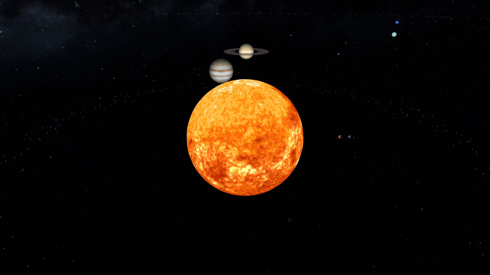

# OpenGL Engine & Primitive Generator
OpenGL based engine that parses a XML file containing a scene

## Usage
* install with:
```
bash build.sh
```
* run generator with:
```
./target/release/bin/generator --help
```
* run engine with:
```
./target/release/bin/engine input_file
```
you can find examples [here](scenes)

## Examples



## Authors
* [João Teixeira](https://github.com/jtexeira)
* [José Filipe de Sousa Matos Ferreira](https://github.com/JoseFilipeFerreira)
* [Miguel André da Silva Solino](https://github.com/Manilator)

## License

This project is licensed under the MIT License - see the [LICENSE](LICENSE) file for details
